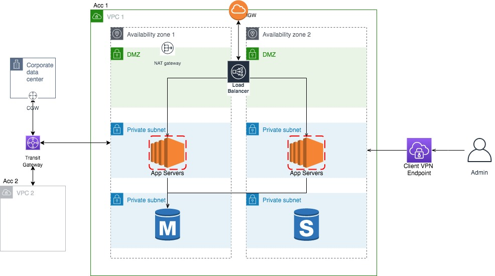
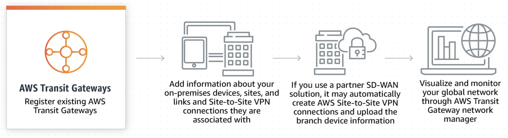

# Security Best Practices

## Multi-account strategy
---
Multiple accounts provides a clean, robust and secure mechanism to isolate the control of data plane access to contained resources, therefore **reducing the blast radius**. The account boundary is very effective against **human error** and **misconfigured IAM policies or security groups**.

## Connect your Amazon VPCs and on-premises networks to a single gateway
---
 With **AWS Transit Gateway**, you only have to **create and manage a single connection** from the central gateway in to each Amazon VPC, on-premises data center, or remote office across your network. Transit Gateway acts as **a hub that controls how traffic is routed** among all the connected networks which act like spokes. 
 Traffic between an Amazon VPC and AWS Transit Gateway remains on AWS's private network and it is **not exposed to the public internet**. This reduces threat vectors such as distributed denial of service (DDoS) attacks and common exploits, such as SQL injection, cross-site scripting, cross-site request forgery, or abuse of broken authentication code. Transit Gateway inter-region peering also **encrypts inter-region traffic with no single point of failure or bandwidth bottleneck**.

 Getting started: https://docs.aws.amazon.com/vpc/latest/tgw/tgw-getting-started.html
 https://docs.aws.amazon.com/vpc/latest/tgw/tgw-vpn-attachments.html

## Global view of your cloud and on on-premises networks
---
 Benefits of **AWS Transit Gateway network manager**:
 * Centralized Network Monitoring
 * Global Network Visibility
 * SD-WAN Integration

 How it works: 
 

 Use cases:
 * Quickly add on-premises locations
 * Respond to connectivity problems
 * Identify global network issues

 Getting started: https://docs.aws.amazon.com/vpc/latest/tgw/network-manager-getting-started.html
 

## Securely access your AWS resources and resources in your on-premises network
---

With **AWS Client VPN**, you can access your resources from any location using an OpenVPN-based VPN client.

Features of Client VPN:
* **Secure connections** — It provides a secure TLS connection from any location using the OpenVPN client.

* **Managed service** — It is an AWS managed service, so it removes the operational burden of deploying and managing a third-party remote access VPN solution.

* **High availability and elasticity** — It automatically scales to the number of users connecting to your AWS resources and on-premises resources.

* **Authentication** — It supports client authentication using Active Directory and certificate-based authentication.

* **Granular control** — It enables you to implement custom security controls by defining network-based access rules. These rules can be configured at the granularity of Active Directory groups. You can also implement access control using security groups.

* **Ease of use** — It enables you to access your AWS resources and on-premises resources using a single VPN tunnel.

* **Manageability** — enables you to view connection logs, which provide details on client connection attempts. You can also manage active client connections, with the ability to terminate active client connections.

* **Deep integration** — integrates with existing AWS services, including AWS Directory Service and Amazon VPC.

### Authentication

Implemented at the first point of entry into the AWS Cloud. It is used to **determine whether clients are allowed to connect to the Client VPN endpoint**. If authentication succeeds, clients connect to the Client VPN endpoint and establish a VPN session. If authentication fails, the connection is denied and the client is prevented from establishing a VPN session.

1. **Active Directory Authentication**
Clients are authenticated against existing Active Directory groups. Using AWS Directory Service, Client VPN can connect to existing Active Directories provisioned in AWS or in your on-premises network.
Client VPN supports multi-factor authentication (MFA) when it's enabled for AWS Managed Microsoft AD or AD Connector.

2. **Mutual Authentication**
Client VPN uses certificates to perform authentication between the client and the server. Certificates are a digital form of identification issued by a certificate authority (CA). The server uses client certificates to authenticate clients when they attempt to connect to the Client VPN endpoint. The server and client certificates must be uploaded to AWS Certificate Manager (ACM).

### Authorization:

1. **Security Groups**
Client VPN automatically integrates with security groups. When you associate a subnet with a Client VPN endpoint, we automatically apply the VPC's default security group. You can change the security group after you associate the first target network. You can **enable Client VPN users to access your applications in a VPC, by adding a rule to allow traffic from the security group that was applied to the association**. Conversely, you can **restrict access for Client VPN users, by not specifying the security group that was applied to the association**. The security group rules you require might also depend on the kind of VPN access you want to configure. 
Apply a Security Group to a Target Network: https://docs.aws.amazon.com/vpn/latest/clientvpn-admin/cvpn-working-target.html#cvpn-working-target-apply

2. **Network-based Authorization**
Implemented using authorization rules. For each network that you want to enable access, you must **configure authorization rules that limits the users who have access**. For a specified network, you configure the Active Directory group that is allowed access. Only users who belong to the specified Active Directory group can access the specified network. If you are not using Active Directory, or you want to open access to all users, you can specify a rule that grants access to all clients.
Authorization Rules: https://docs.aws.amazon.com/vpn/latest/clientvpn-admin/cvpn-working-rules.html

Getting started: https://docs.aws.amazon.com/vpn/latest/clientvpn-admin/cvpn-getting-started.html

## Internetwork Traffic Privacy in Amazon VPC

Security at every layer:
* **Security groups** - control inbound and outbound traffic at the instance level
* **Network access control lists (ACLs)** - control inbound and outbound traffic at the subnet level
* **Flow logs** - capture information about the IP traffic going to and from network interfaces in your VPC, subnets or individual ENIs
* **Traffic mirroring** - You can copy network traffic from an elastic network interface of an Amazon EC2 instance and then send them to out-of-band security and monitoring appliance

Read more: https://docs.aws.amazon.com/vpc/latest/userguide/VPC_Security.html